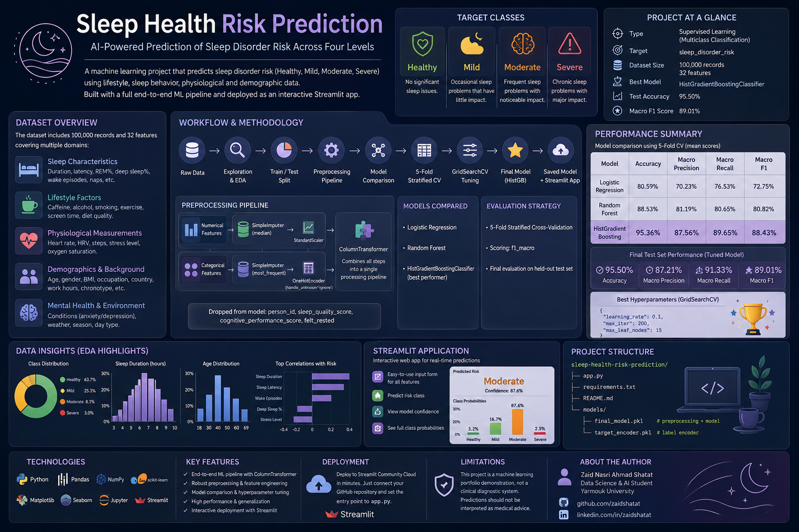

# Sleep Health Risk Prediction

<p align="center">
  
</p>

A multiclass machine learning project that predicts **sleep disorder risk** across four classes:

- Healthy
- Mild
- Moderate
- Severe

The project uses a full scikit-learn pipeline for preprocessing, model selection, hyperparameter tuning, and evaluation, followed by a Streamlit web application for interactive predictions.

## Project Overview

The dataset contains **100,000 records and 32 columns** covering sleep behavior, lifestyle, physiological measurements, and demographic information.

### Machine Learning task

**Type:** Supervised learning — multiclass classification  
**Target:** `sleep_disorder_risk`  
**Classes:** `Healthy`, `Mild`, `Moderate`, `Severe`

## Workflow

```text
Raw Data
   ↓
Data Inspection & EDA
   ↓
Train / Test Split
   ↓
Preprocessing Pipeline
   ├── Numerical: median imputation + StandardScaler
   └── Categorical: most-frequent imputation + OneHotEncoder
   ↓
Model Comparison
   ├── Logistic Regression
   ├── Random Forest
   └── HistGradientBoostingClassifier
   ↓
5-Fold Stratified Cross-Validation
   ↓
GridSearchCV
   ↓
Final HistGradientBoosting Model
   ↓
Test Evaluation
   ↓
Saved Model + Streamlit App
```

The preprocessing and classifier are stored together inside `final_model.pkl`, while `target_encoder.pkl` stores the target label mapping. The notebook uses `joblib.dump()` for both artifacts. 

## Model Performance

The model comparison showed HistGradientBoosting as the strongest candidate:

| Model | Accuracy | Macro Precision | Macro Recall | Macro F1 |
|---|---:|---:|---:|---:|
| Logistic Regression | 80.59% | 70.23% | 76.53% | 72.75% |
| Random Forest | 88.53% | 81.19% | 80.65% | 80.82% |
| **HistGradientBoosting** | **95.36%** | **87.56%** | **89.65%** | **88.43%** |

After hyperparameter tuning with `GridSearchCV` and `f1_macro` scoring, the best configuration was:

```python
{
    "learning_rate": 0.1,
    "max_iter": 200,
    "max_leaf_nodes": 15
}
```

The final model achieved on the held-out test set:

- **Accuracy:** 95.50%
- **Macro Precision:** 87.21%
- **Macro Recall:** 91.33%
- **Macro F1:** 89.01%

## Preprocessing

The trained pipeline uses:

- `SimpleImputer(strategy="median")` for numerical features
- `StandardScaler()` for numerical features
- `SimpleImputer(strategy="most_frequent")` for categorical features
- `OneHotEncoder(handle_unknown="ignore")` for categorical features
- `ColumnTransformer` to combine all preprocessing steps

The project also explicitly excludes several columns from the final model pipeline, including `person_id`, `sleep_quality_score`, `cognitive_performance_score`, and `felt_rested`.

## Streamlit App

The included `app.py` provides an interactive interface where users can enter sleep, lifestyle, demographic, and physiological information and receive:

- Predicted risk class
- Model confidence
- Class probabilities

## Project Structure

```text
sleep-health-risk-prediction/
│
├── app.py
├── requirements.txt
├── README.md
│
└── models/
    ├── final_model.pkl
    └── target_encoder.pkl
```

## Run Locally

### 1. Clone the repository

```bash
git clone <YOUR_GITHUB_REPOSITORY_URL>
cd sleep-health-risk-prediction
```

### 2. Create a virtual environment

```bash
python -m venv .venv
```

Activate it:

**Windows**

```bash
.venv\Scripts\activate
```

**macOS / Linux**

```bash
source .venv/bin/activate
```

### 3. Install dependencies

```bash
pip install -r requirements.txt
```

### 4. Start the app

```bash
streamlit run app.py
```

The application will open in your browser.

## Deployment

This project is suitable for deployment on **Streamlit Community Cloud**.

Upload the repository to GitHub and set the Streamlit entry point to:

```text
app.py
```

The `requirements.txt` file tells the deployment environment which Python packages and versions are required to load and run the saved model correctly.

> **Important:** The saved model was created with scikit-learn **1.7.2**, so the project pins that version in `requirements.txt` for compatibility.

## Limitations

This project is a machine learning portfolio demonstration, not a clinical diagnostic system. The predictions should not be interpreted as medical advice or diagnosis.

## Technologies

Python · Pandas · NumPy · Matplotlib · Seaborn · scikit-learn · Joblib · Streamlit
